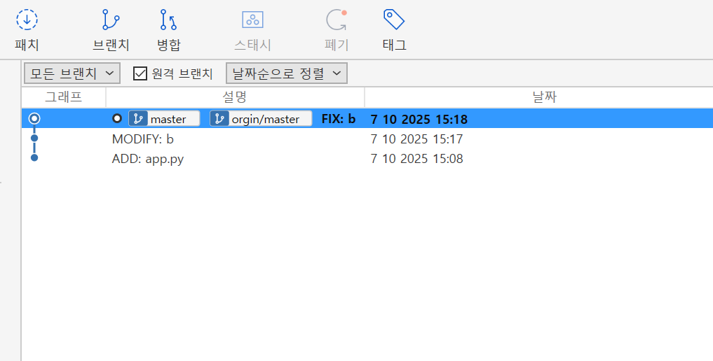
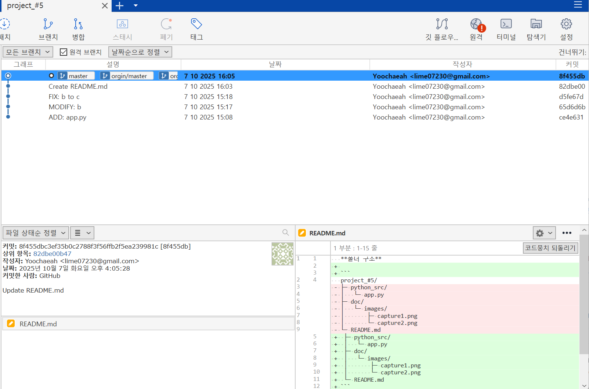

**폴더 구조**
project_#5/
├─ python_src/
│   └─ app.py
├─ doc/
│   └─ images/
│       ├─ capture1.png
│       └─ capture2.png
└─ README.md

1. **src/app.py 작성 및 첫 commit**
   - commit 메시지: `ADD: app.py`
   - 기능: **a 변수에 문자값을 할당함.**

2. **두 번째 commit**
   - commit 메시지: `MODIFY: b`
   - 수정/추가한 내용: **b 변수를 추가함**
3. **세 번째 commit**
   - commit 메시지: `FIX: b to c`
   - 수정/추가한 내용: **b 변수를 c로 수정함.**

---

## 4. 캡처 이미지
- `capture1.png` → Commit 완료 상태 화면
- `capture2.png` → GitHub push → pull 후 VS Code 화면

예시:

---

## 5. GitHub Repository URL
- URL: [https://github.com/Yoochaeah/project_-5.git]

---

## 6. 느낀 점 (선택 사항)
- 이번 과제를 하면서 배운 점:Git 초기화의 중요성, 소스트리를 이용한 Push와 Pull 과정, readme 작성법
- Git/GitHub을 활용하며 어려웠던 점: Git 초기화 위치 설정, 폴더 속의 폴더 위치, Push/Pull 순서 및 GitHub에서 변경 사항을 만들어 Pull하는 과정
- 앞으로 더 해보고 싶은 것: 브랜치와 병합 후 연결
